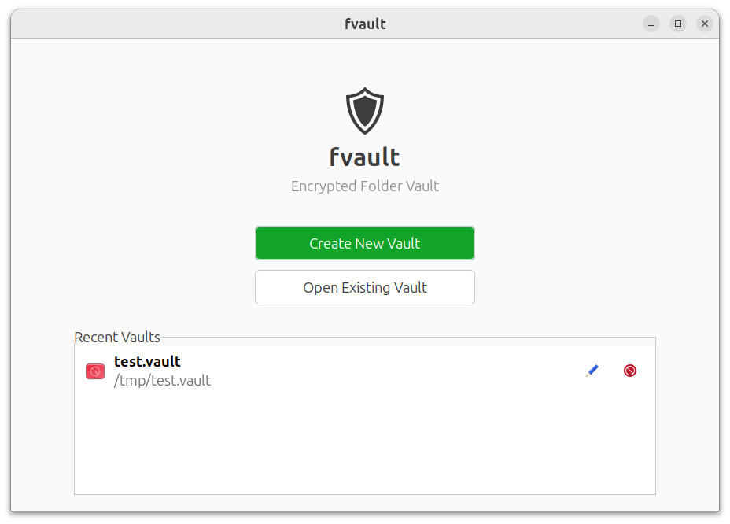
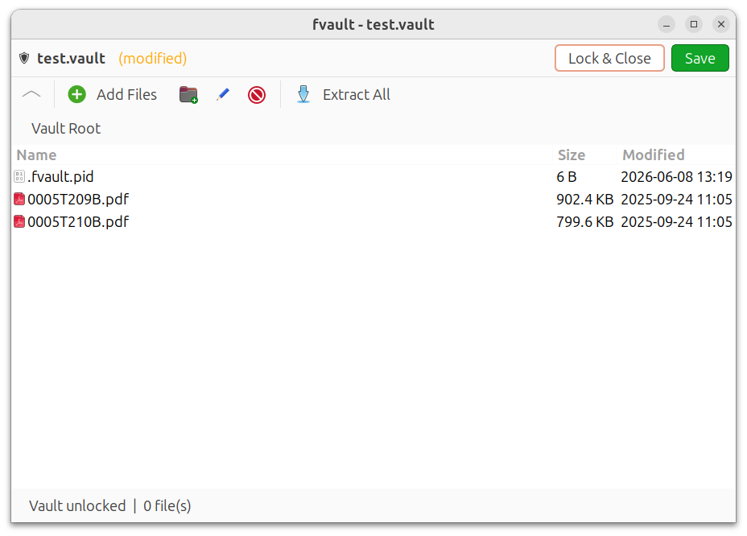

# fvault

A self-contained GTK desktop application for encrypting and decrypting folders on Linux. Folders are packed into single `.vault` files using AES-256-GCM encryption with scrypt key derivation. Files can be browsed, opened, edited, added, and removed entirely within the app.

<p align="center">
  
  
</p>

## Features

- Encrypt any folder into a single password-protected `.vault` file
- Built-in file browser with directory navigation
- Open files directly from the vault using system default applications
- Add, remove, rename files and create folders within the vault
- Drag-and-drop files from your file manager into the vault
- Extract the entire vault back to a regular folder
- Recent vaults list for quick access
- Optional desktop integration (double-click `.vault` files to open)

## Security

| Property | Detail |
|---|---|
| Encryption | AES-256-GCM (authenticated encryption) |
| Key derivation | scrypt (N=2^20, r=8, p=1) with 16-byte random salt |
| Nonce | 12 bytes, randomly generated per encryption |
| Auth tag | 16-byte GCM tag (integrity + authenticity) |
| Temp files | Stored in `$XDG_RUNTIME_DIR/fvault-*/` with `0700` permissions (see below) |
| Atomic writes | Vault saves write to a `.tmp` file first, then atomically replace |

Passwords are never written to disk or passed as command-line arguments. They are held in process memory only while a vault is open and cleared when the vault is locked.

### Decrypted file cleanup

While a vault is open, its decrypted contents exist in a temporary directory. fvault uses multiple layers to ensure these files don't persist after the app closes:

| Scenario | Cleanup mechanism |
|---|---|
| Normal close / Lock & Close | App explicitly deletes the temp dir |
| Window closed via X button | `delete-event` handler deletes the temp dir |
| Unhandled Python exception | `atexit` handler wipes all temp dirs created by the process |
| `SIGTERM` (`kill <pid>`) | Signal handler wipes temp dirs, then exits |
| `SIGHUP` (terminal hangup) | Signal handler wipes temp dirs, then exits |
| `Ctrl+C` | Python raises `KeyboardInterrupt`, triggering the `atexit` handler |
| Previous crash left orphans | On next launch, fvault sweeps stale `fvault-*` dirs (checks PID files to distinguish live sessions from dead ones) |
| `kill -9` / OOM / power loss | Temp dirs survive until next launch (startup sweep) or next reboot |

Temp dirs are created in `$XDG_RUNTIME_DIR` (typically `/run/user/<uid>`), which is a user-private tmpfs mount — not world-readable, and automatically cleared on reboot. Each temp dir contains a `.fvault.pid` file recording the owning process ID, which the startup sweep uses to safely remove only dirs whose process is no longer alive. If `$XDG_RUNTIME_DIR` is not set, falls back to `/tmp`.

## Requirements

- Python 3.10+
- GTK 3 with PyGObject (`python3-gi`, `gir1.2-gtk-3.0`)
- Python `cryptography` library (>= 41.0)

On Ubuntu/Debian these are typically pre-installed. If not, the installer handles them.

## Installation

### Quick start (no install)

Run directly from the source directory:

```bash
python3 fvault.py
```

### System install

The install script copies the application to `~/.local/share/fvault/`, creates a launcher in `~/.local/bin/`, and registers the `.vault` MIME type so you can double-click vault files to open them:

```bash
git clone <repo-url> folder-encryptor
cd folder-encryptor
./install.sh
```

The installer will:

1. Check for Python 3, GTK 3 bindings, and the `cryptography` library (installs missing deps)
2. Copy application files to `~/.local/share/fvault/`
3. Create the `fvault` launcher in `~/.local/bin/`
4. Register the `application/x-fvault` MIME type for `.vault` files
5. Install a `.desktop` entry so `.vault` files open with fvault

If `~/.local/bin` is not in your `PATH`, add it:

```bash
echo 'export PATH="$HOME/.local/bin:$PATH"' >> ~/.bashrc
source ~/.bashrc
```

### Uninstall

```bash
./uninstall.sh
```

This removes the application files, launcher, MIME type, and desktop entry. It will ask before removing your config (`~/.config/fvault/`). Your `.vault` files are never touched.

## Usage

### Launching

```bash
fvault                      # Open the app (home screen)
fvault /path/to/file.vault  # Open a specific vault directly
python3 fvault.py           # Run from source without installing
```

### Creating a vault

1. Click **Create New Vault**
2. Select the folder you want to encrypt
3. Choose where to save the `.vault` file
4. Enter a password (you'll be asked to confirm it)
5. Wait for encryption to complete
6. Optionally delete the original unencrypted folder

### Opening a vault

1. Click **Open Existing Vault** (or click a vault in the Recent Vaults list)
2. Select the `.vault` file
3. Enter the password (3 attempts allowed)
4. The file browser opens showing the vault contents

### Working with files

Once a vault is open, the toolbar provides these actions:

| Action | Button | Shortcut |
|---|---|---|
| Go up one directory | **Up** | `Backspace` |
| Open file/folder | (double-click) | `Enter` |
| Add files | **Add Files** | -- |
| Create folder | **New Folder** | -- |
| Rename | **Rename** | `F2` |
| Delete | **Delete** | `Delete` |
| Extract all to folder | **Extract All** | -- |

- Double-clicking a file opens it with your system's default application via `xdg-open`
- You can drag and drop files from your system file manager into the vault
- Multiple files can be selected for deletion

### Saving and closing

- **Save** re-encrypts the vault with all changes
- **Lock & Close** saves (if modified) and returns to the home screen, wiping the temporary decrypted files
- Closing the window with unsaved changes prompts you to save, discard, or cancel

## `.vault` file format

Each `.vault` file is a self-contained binary file with this layout:

```
Offset  Size     Content
------  -------  ----------------------------------------
0       8        Magic bytes: FVAULT\x01\x00
8       16       Salt (random, for scrypt key derivation)
24      12       Nonce (random, for AES-256-GCM)
36      4        Metadata length in bytes (uint32, big-endian)
40      varies   Metadata (JSON, unencrypted)
40+N    varies   Encrypted payload (AES-256-GCM ciphertext + 16-byte auth tag)
```

The **metadata** is a JSON object stored in cleartext (it contains no sensitive data):

```json
{
  "version": 2,
  "created": "2026-06-08T12:00:00+00:00",
  "modified": "2026-06-08T13:30:00+00:00",
  "files_count": 42,
  "folder_name": "my-documents"
}
```

The **encrypted payload** is a gzip-compressed tar archive of the folder contents, encrypted as a single AES-256-GCM blob. The last 16 bytes of the payload are the GCM authentication tag. The raw metadata bytes are passed as **Associated Authenticated Data (AAD)** to AES-GCM, meaning the metadata is integrity-protected even though it is stored in cleartext. Tampering with the metadata will cause decryption to fail.

### Key derivation

The encryption key is derived from the password using scrypt:

```
key = scrypt(password_utf8, salt, N=1048576, r=8, p=1, key_length=32)
```

This produces a 256-bit key. The high cost factor (N=2^20) makes brute-force attacks expensive.

## Emergency recovery (decrypt without the app)

If the fvault application stops working (e.g. due to an OS upgrade breaking GTK 3, Python version changes, or any other reason), you can recover your files using only Python and the `cryptography` library. No part of the app is needed -- just the `.vault` file and your password.

### Prerequisites

You need Python 3 and the `cryptography` package:

```bash
pip install cryptography
```

### Step-by-step recovery

Save the following script as `recover.py` and run it:

```python
#!/usr/bin/env python3
"""Recover files from a .vault file without the fvault application."""

import io
import json
import os
import struct
import sys
import tarfile
import getpass

from cryptography.hazmat.primitives.kdf.scrypt import Scrypt
from cryptography.hazmat.primitives.ciphers.aead import AESGCM


def recover(vault_path, output_dir):
    # 1. Read the vault file
    with open(vault_path, "rb") as f:
        magic = f.read(8)
        if magic != b"FVAULT\x01\x00":
            print("ERROR: Not a valid .vault file.")
            sys.exit(1)

        salt = f.read(16)           # 16-byte salt
        nonce = f.read(12)          # 12-byte nonce
        meta_len = struct.unpack(">I", f.read(4))[0]
        metadata = f.read(meta_len) # raw metadata bytes (used as AAD)
        ciphertext = f.read()       # encrypted tar.gz

    # 2. Show metadata
    meta = json.loads(metadata)
    print(f"Vault version:  {meta.get('version')}")
    print(f"Created:        {meta.get('created')}")
    print(f"Files:          {meta.get('files_count')}")
    print(f"Folder name:    {meta.get('folder_name')}")
    print()

    # 3. Get password
    password = getpass.getpass("Password: ")

    # 4. Derive the encryption key using scrypt
    kdf = Scrypt(salt=salt, length=32, n=2**20, r=8, p=1)
    key = kdf.derive(password.encode("utf-8"))

    # 5. Decrypt with AES-256-GCM (metadata bytes are the AAD)
    try:
        aesgcm = AESGCM(key)
        tar_data = aesgcm.decrypt(nonce, ciphertext, metadata)
    except Exception:
        print("ERROR: Wrong password or corrupted vault.")
        sys.exit(1)

    # 6. Extract the tar.gz archive
    os.makedirs(output_dir, exist_ok=True)
    buf = io.BytesIO(tar_data)
    with tarfile.open(fileobj=buf, mode="r:gz") as tar:
        tar.extractall(output_dir, filter="data")

    print(f"Recovered to: {output_dir}")


if __name__ == "__main__":
    if len(sys.argv) != 3:
        print(f"Usage: python3 {sys.argv[0]} <file.vault> <output-directory>")
        sys.exit(1)
    recover(sys.argv[1], sys.argv[2])
```

Run it:

```bash
python3 recover.py my-documents.vault ./recovered-files/
```

### Manual recovery (no script)

If you prefer to do it entirely by hand in a Python REPL:

```python
import io, struct, tarfile, getpass
from cryptography.hazmat.primitives.kdf.scrypt import Scrypt
from cryptography.hazmat.primitives.ciphers.aead import AESGCM

# Read the vault
f = open("my-documents.vault", "rb")
assert f.read(8) == b"FVAULT\x01\x00"    # magic
salt = f.read(16)                          # salt
nonce = f.read(12)                         # nonce
meta_len = struct.unpack(">I", f.read(4))[0]
metadata = f.read(meta_len)               # keep — needed as AAD for decrypt
ciphertext = f.read()
f.close()

# Derive key and decrypt (metadata is the AAD)
password = getpass.getpass()
kdf = Scrypt(salt=salt, length=32, n=1048576, r=8, p=1)
key = kdf.derive(password.encode("utf-8"))
tar_data = AESGCM(key).decrypt(nonce, ciphertext, metadata)

# Extract
with tarfile.open(fileobj=io.BytesIO(tar_data), mode="r:gz") as tar:
    tar.extractall("./recovered", filter="data")
```

### Recovery with OpenSSL (no Python)

If Python is also unavailable, the vault can be recovered using any tool that supports scrypt key derivation and AES-256-GCM decryption. The raw steps are:

1. Read bytes 8-23 as the **salt** (16 bytes, hex-encode for CLI tools)
2. Read bytes 24-35 as the **nonce/IV** (12 bytes)
3. Read bytes 36-39 as a big-endian uint32 giving the **metadata length** N
4. Read N bytes of **metadata** starting at byte 40 — this is the **AAD** (Associated Authenticated Data) required for decryption
5. Everything from byte 40+N to the end of the file is the **ciphertext** (last 16 bytes are the GCM auth tag)
6. Derive the key: `scrypt(password_utf8, salt, N=1048576, r=8, p=1, dkLen=32)`
7. Decrypt: `AES-256-GCM(key, nonce, ciphertext, aad=metadata_bytes)`
8. The result is a gzip-compressed tar archive — decompress and extract

Example extracting the raw components with `dd` and `xxd`:

```bash
# Extract salt (bytes 8-23)
dd if=my.vault bs=1 skip=8 count=16 2>/dev/null | xxd -p

# Extract nonce (bytes 24-35)
dd if=my.vault bs=1 skip=24 count=12 2>/dev/null | xxd -p

# Read metadata length (bytes 36-39, big-endian uint32)
dd if=my.vault bs=1 skip=36 count=4 2>/dev/null | xxd -p
# Convert hex to decimal to get N

# Extract metadata / AAD (N bytes starting at byte 40)
dd if=my.vault bs=1 skip=40 count=$N 2>/dev/null > metadata.bin

# Extract ciphertext (from byte 40+N to EOF)
dd if=my.vault bs=1 skip=$((40 + N)) 2>/dev/null > encrypted.bin
```

From there, use any language or tool that supports scrypt + AES-256-GCM to decrypt `encrypted.bin` with `metadata.bin` as the AAD, then decompress the result with `tar xzf`.

## Configuration

fvault stores a small config file at `~/.config/fvault/config.json` containing only the list of recently opened vault paths (up to 20 entries). No passwords or keys are ever stored on disk.

## Project structure

```
folder-encryptor/
├── fvault.py           # Main GTK application (entry point)
├── crypto.py           # AES-256-GCM encryption + scrypt key derivation
├── vault.py            # .vault file format: create, open, save, info
├── filebrowser.py      # GTK TreeView file browser widget
├── dialogs.py          # Password, confirmation, and error dialogs
├── config.py           # Recent vaults list persistence
├── requirements.txt    # Python dependencies
├── install.sh          # System installer
├── uninstall.sh        # Clean uninstaller
└── desktop/
    ├── fvault.desktop      # Desktop entry for .vault file association
    └── fvault-vault.xml    # MIME type definition (application/x-fvault)
```

## License

MIT
